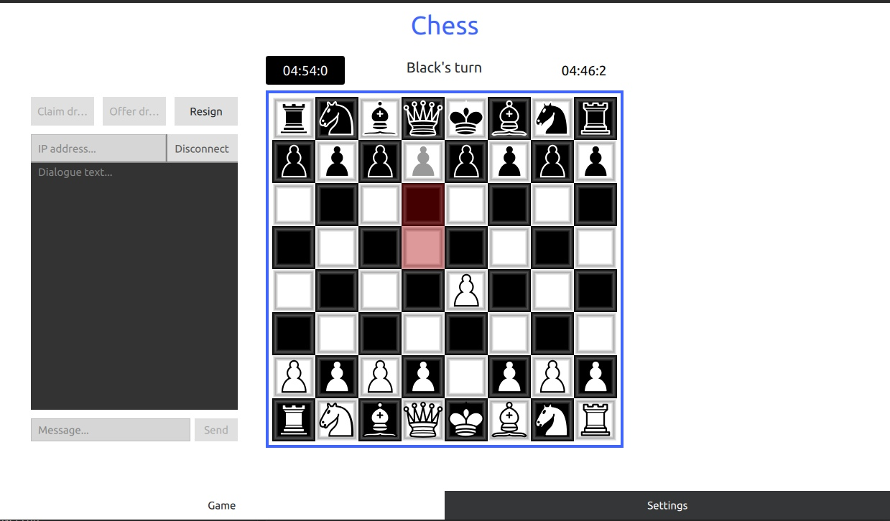

### Chess-QML
Small software project from university. Chess GUI written in QML and logic is in C++. CMake is used as build system. App consists off two parts: server and client. Client has 2 game modes: offline and online. Online is currently not tested. Offline should have 2 modes: player and AI, but unfortunately computer player isn't finished. 

### GUI
 "GUI"

### TODO
- [ ] Test online
- [ ] Finish and fix computer player
- [ ] Fix GUI layout bugs
